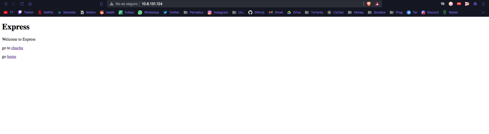
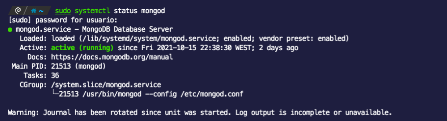
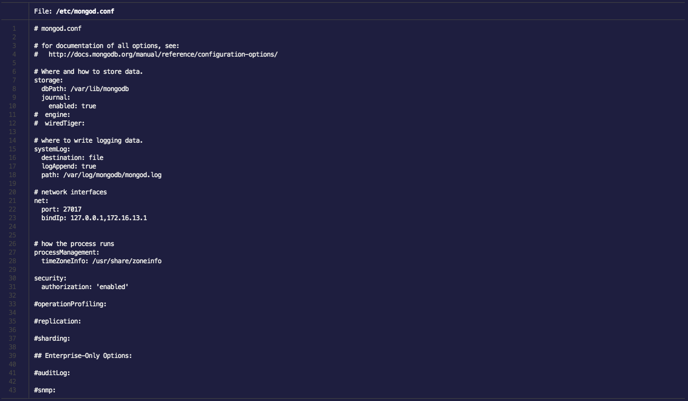
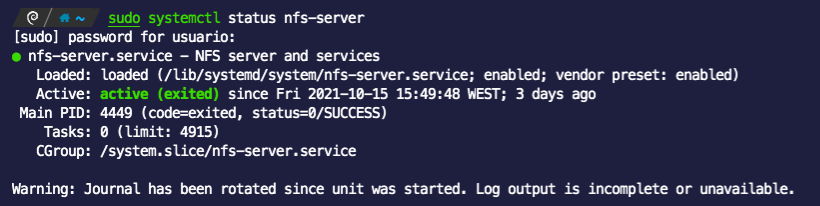
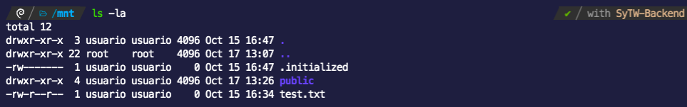
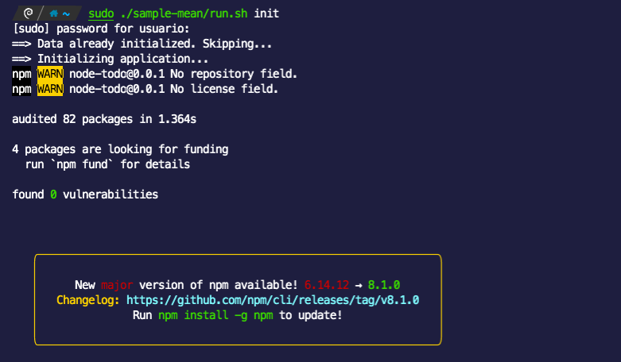
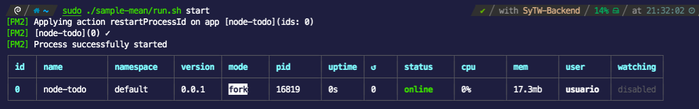
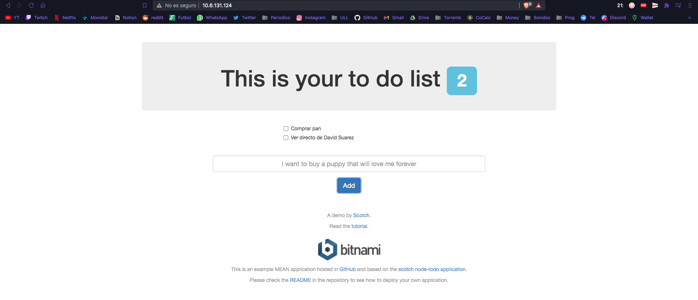

# Despliegue de una aplicacion MEAN

En esta practica vamos a configurar la maquina proxy, para que nos redirija hacia la maquina backend, que se encarga de resolver las peteciones, y esta, a su ves, se comunicara con la maquina de base de datos para obtener los datos necesarios que necesite el propio backend, pudiendo asi despleguer la aplicacion web.

## Configurar la MV que hace la funcion de Proxy HTTP

Empezaremos configurando la maquina Proxy, en la cual habra que configurar que escuche por el puerto por defecto, el 80, y redirigir las peticiones a la maquina backend, que estara escuchando en el puerto 3000. Para eso vamos a instalar en la maquina proxy ```nginx```:

```bash
sudo apt update
sudo apt install nginx
```

Luego configuramos nginx para que escuche por el puerto 80:

```bash
sudo iptables -A INPUT -p tcp --dport 80 -j ACCEPT
```

Podemos comprobar el estado de nginx en cualquier momento con el siguiente comando:

```bash
sudo systemctl status nginx
```

Ahora vamos a dirigirnos a la carpeta ```/etc/nginx/sites-available```, donde vamos a crear una copia del fichero ```default```:

```bash
cd /etc/nginx/sites-available
cp default backend.conf
```

Vamos a cambiar el contenido de backend por lo siguiente:

```c
server {

  listen 80;

  location / {

    proxy_pass http://172.16.12.2:3000

  }

}
```

Una vez creado el fichero vamos a deslinkear el fichero default y linkear este nuevo backend.conf:

```bash
sudo unlink /etc/nginx/sites-available/default
sudo ln -s /etc/nginx/sites-available/backend.conf /etc/nginx/sites-enabled
```

Una vez linkeada la nueva configuracion vamos a resetear nginx:

```bash
sudo service nginx configtest
sudo service nginx restart
```

## Configuración del servidor backend NodeJS

Para configurar la maquina backend necesitaremos instalar nodeJS:

```bash
curl -sL https://deb.nodesource.com/setup_10.x | sudo -E bash -
sudo apt install nodejs
sudo apt install build-essential libssl-dev
node -v
```

Habilitamos el puerto 3000 para que conecto con el proxy:

```bash
sudo iptables -A INPUT -p tcp --dport 3000 -j ACCEPT
```

Probamos que funciona los puertos probando con una aplicacion de ejemplo, ```express-start```:

```bash
git clone https://github.com/crguez/express-start.git
cd express-start
npm install ip ejs express
node hello/hello.js
```

Una vez ejecutemos el ultimo comando el servidor express-start empezara a escuchar por el puerto 3000:

<kbd>
  
</kbd>

Ahora entrariamos en el navegador a la direccion IP de la maquina proxy y nos deberia desplegar la aplicacion express-start que se esta ejecutando en el backend:

<kbd>
  
</kbd>

## Configuración del servidor de base de datos con MongoDB

Instalamos MongoDB

```bash
sudo apt-get install gnupg
wget -qO - https://www.mongodb.org/static/pgp/server-5.0.asc | sudo apt-key add -
echo "deb http://repo.mongodb.org/apt/debian stretch/mongodb-org/5.0 main" | sudo tee /etc/apt/sources.list.d/mongodb-org-5.0.list
sudo apt-get update
sudo apt-get install -y mongodb-org
```

Activamos y reiniciamos MongoDB

```bash
sudo systemctl enable mongod
sudo systemctl start mongod
sudo systemctl daemon-reload
sudo systemctl status mongod
```

<kbd>
  
</kbd>

Configuramos el usuario root en MongoDB

```bash
mongo
$\ use admin
$\ db.createUser({user: "Noah", pwd: "******", roles: ["root"]});
$\ quit()
```

Cambiamos ajustes en ```mongod.conf```:

```bash
sudo nano /etc/mongod.conf
```

El fichero quedaria asi:

<kbd>
  
</kbd>

Tendremos que añadir la IP de la propia maquina para poder acceder desde Backend al MongoDB de esta maquina. Tambien tendremos que activar la opcion en *security* con *authorization: 'enabled'*.

Reiniciamos el servicio de MongoDB y accedemos con nuestras credenciales:

```bash
sudo systemctl restart mongod
mongo admin -u Noah -p *****
```

## Configuración del servidor de base de datos como sistema de ficheros compartido

Ahora toca instalar un almacenamiento compartido que tendremos en la base de datos, sera una carpeta ```public```, a la cual mediante nfs podremos tener acceso desde la maquina Backend.

Primero instalamos nfs:

```bash
sudo apt-get install nfs-kernel-server
sudo apt-get install nfs-common
```

Hacemos una serie de cambios en el fichero ```nfs-common```, ```nfs-kernel-server``` y ```exports```:

```bash
sudo nano /etc/default/nfs-common
```

Cambiamos los atriburos con estos nuevos valores:

```bash
NEED_STATD=”no”
NEED_IDMAPD=”yes”
```
```bash
sudo nano /etc/default/nfs-kernel-server
```
```bash
RPCNFSDOPTS="-N 2 -N 3"
RPCMOUNTDOPTS="--manage-gids -N 2 -N 3"
```
```bash
sudo nano /etc/exports
```
```bash
/home/usuario/public 172.16.11.0/24(rw,no_root_squash,no_subtree_check,sync)
```

Ahora mismo tenemos configurado nfs para la carpeta ```/home/usuario/public```. Toca aplicar los cambios y abrir los puertos:

```bash
exportfs -a
sudo iptables -A INPUT -p tcp --dport 2049 -j ACCEPT
sudo iptables -A INPUT -p udp --dport 2049 -j ACCEPT
```

Activamos el servicio nfs:

```bash
sudo systemctl enable nfs-server
sudo systemctl start nfs-server
sudo systemctl status nfs-server
```

<kbd>
  
</kbd>

Una vez tenemos configurado nfs en la maquina base de datos, vamos a configurar nfs en la maquina backend para poder montar la unidad ```public```.

Instalamos la utilidad nfs:

```bash
sudo apt-get install nfs-common
```

Montamos la unidad en ```/mnt```

```bash
sudo mount -t nfs4 -o proto=tcp,port=2049 172.16.11.1:/home/usuario/public /mnt
```

Añadimos en el fichero fstab la siguiente linea:

```bash
sudo nano /etc/fstab
```

```bash
172.16.11.1:/home/usuario/public /mnt nfs4 _netdev,auto 0 0
```

Ahora podremos acceder a la carpeta ````public```` y añadir archivos desde el backend.

<kbd>
  
</kbd>

## Desplegar en el backend una aplicacion MEAN de prueba

Vamos a descargar una aplicacion web que vamos a ejecutar en el backend, la cual utilizara mongodb de la maquina base de datos, asi como la capeta compartida de la misma maquina:

Primero descargamos el repo de la aplicacion:

```bash
git clone https://github.com/bitnami/sample-mean.git
```

Nos quedara la carpeta sample-mean, que tendra esta estructura:

```
📦sample-mean
 ┣ 📂app
 ┣ 📂config
 ┣ 📂images
 ┣ 📂node_modules
 ┣ 📂public
 ┣ 📜.gitignore
 ┣ 📜README.md
 ┣ 📜license
 ┣ 📜package-lock.json
 ┣ 📜package.json
 ┣ 📜run.sh
 ┗ 📜server.js
```

Tenemos que hacer una serie de cambios para que funcione, en el archivo run.sh vamos a cambiar la palabra *bitnami* por nuestro usuario, el cual es *usuario*.
Luego tenemos que crear el archivo ```/root/.deployment.env```, en el cual podemos crear y utilizar las variables de entorno.

El archivo ```.deployment.env``` quedara asi:

```bash
export DATA_FOLDER="/mnt"
export APP_FOLDER="/home/usuario/sample-mean"
export DATABASE_USER="Noah"
export DATABASE_NAME="admin"
export DATABASE_PASSWORD="*******"
export DATABASE_HOST="172.16.13.1"
export DATABASE_PORT="27017"
export DATABASE_CONNECTION_OPTIONS=""
export BACKEND_PORT="3000"
export PATH="/opt/bitnami/nami/bin:/usr/local/sbin:/usr/local/bin:/usr/sbin:/usr/bin:/sbin:/bin:/opt/bitnami/node/bin:/opt/bitnami/python/bin:/opt/b$
```

Ahora desde la aplicacion podemos acceder a estar variables para poder conectarnos con mongodb de la maquina base de datos, cuya IP es la que aparece en el fichero. (172.16.13.1)

Arrancamos la aplicacion con el script:

```bash
cd sample-mean
sudo ./run.sh init
```

<kbd>
  
</kbd>


Para ejecutar el script habra que instalar pm2.

```bash
sudo npm install pm2 -g
sudo ./run.sh start
```

<kbd>
  
</kbd>

Vemos que la aplicacion ya esta lanzada, solo nos quedaria entrar a la direccion IP de la proxy en el navegador:

<kbd>
  
</kbd>

La aplicacion web ya estaria lanzada de forma indefinida, en caso de querer para el servicio tenemos que ejecutar el script con la opcion *stop*:

```bash
sudo ./run.sh stop
```


<<<<<<< HEAD
=======
* Practica 1: Configurar laboratorio del IaaS ✅
* 
>>>>>>> c92d26b8d107f859a5e30a8ca36f9e5d59ee0a78
